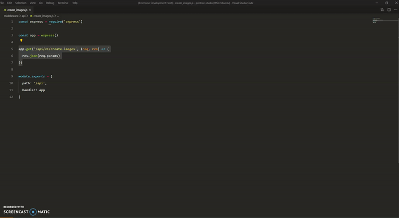

# mem.dev VS Code Extension

With this extension, you can quickly push code snippets into your personal knowledge base at [mem.dev](https://mem.dev), and later convert them into interactive flashcards.

Use it when...

* You come across a new bit of syntax,
* A pairing partner shows you something new,
* You've just pasted in some code from Stack Overflow and finally got it to work

And anytime you feel like you've just learned something new. With mem.dev, this knowledge will stick.

# How it works

First, make sure you have a [mem.dev](https://mem.dev) account, and go to the [auth token](https://mem.dev/auth_token) page.

1. Select a piece of code you wish you'd remember in the future.
2. Press `Ctrl + Shift + P` and then search for the `mem.dev: Create a snippet` command. Or simply right-click the text, and you'll see the same command at the bottom.
3. If this is your first time using the extension, you will be asked for your magic token. Otherwise, simply fill in the title and the source (where this knowledge came from).

# Logging out

Should you ever want to log out, simply press `Ctrl + Shift + P` and then search for the `mem.dev: Logout` command.